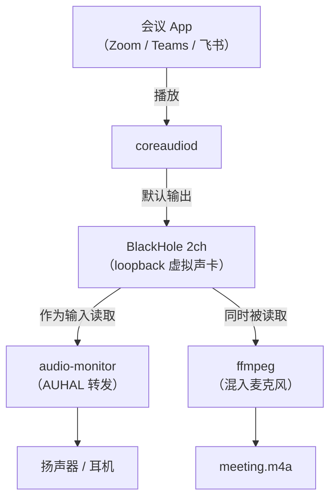
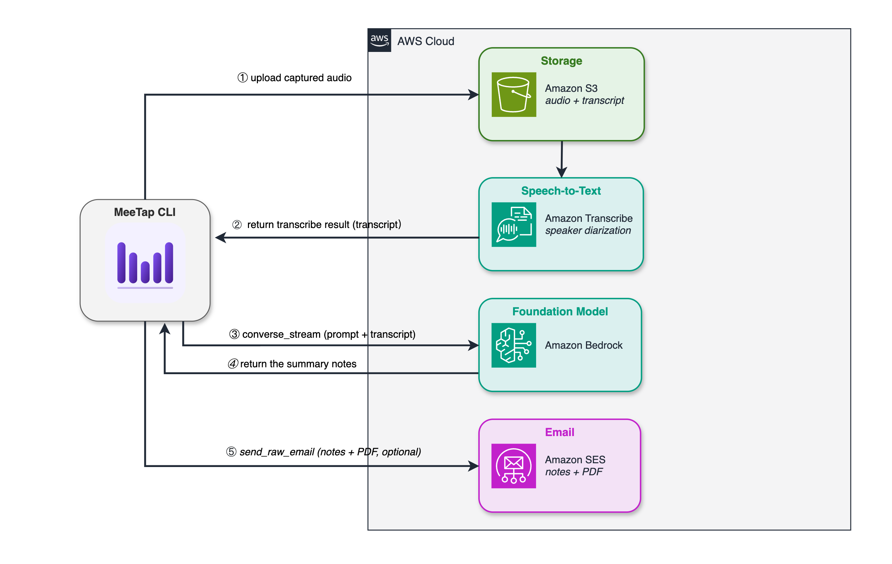
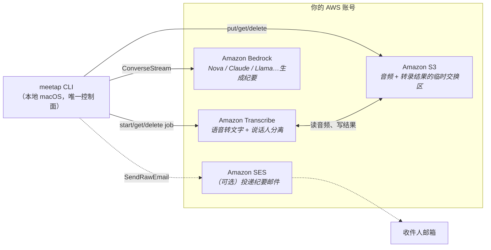
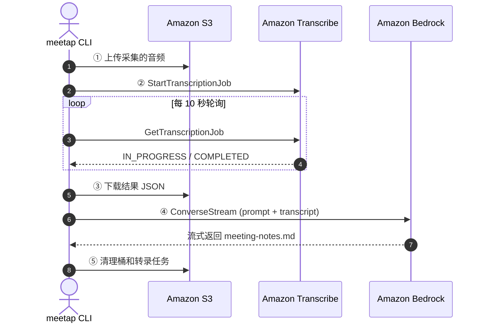

# MeeTap

> 🎙️ **MeeTap** · 一键启用，无感采集，智能纪要 —— 让 Mac 上的每一段音频自动变成结构化笔记。

**MeeTap** 是一款面向 **macOS** 的本地化智能音频转纪要工具，将"音频采集 → 转写 → 摘要"全流程自动化，让会议与学习内容一键沉淀为结构化笔记。

------

### 🔧 工作流程

1. **音频捕获** —— 基于 **BlackHole 虚拟声卡**静默采集 Mac 系统音频，无缝兼容 Zoom、Teams、飞书、腾讯会议等主流会议应用；
2. **语音转写** —— 音频采集结束后自动上传至 **AWS Transcribe**，输出带**说话人分离（Speaker Diarization）**的结构化文本；
3. **智能摘要** —— 通过 **Amazon Bedrock** 调用大语言模型（默认 **Amazon Nova Pro**，一键切换 Claude、Llama、DeepSeek 等），生成条理清晰的**中文会议纪要**。

------

### 🎯 适用场景

除在线会议外，亦可用于 **YouTube 视频、播客、线上课程、访谈录音**等任意 Mac 播放的音视频内容归档，覆盖**会议记录、学习笔记、资料整理、访谈转写**等多样化需求。

------

### ✨ 核心特性

| 特性                 | 说明                                                         |
| :------------------- | :----------------------------------------------------------- |
| 🚀 **开箱即用**       | 首次启动自动生成默认配置，零学习成本，即装即用               |
| 👻 **零侵入音频采集** | 无需以 "Bot 参会者" 身份加入会议，与会者全程无感知，规避合规风险 |
| 💰 **按量计费**       | 无订阅、无最低消费                                           |
| 🔐 **数据主权**       | 所有音频与纪要仅在你**自己的 AWS 账号**内流转，不经第三方云服务；任务结束自动清理，隐私可控 |
| 🌐 **双语 CLI**       | 终端输出支持 `zh-CN` / `en-US` 切换（仅影响界面语言，**纪要内容始终为中文**） |


---

## 一、前置条件

1. **macOS 13+（Ventura 或更新）**
2. **Xcode Command Line Tools**（首次安装会自动提示）
   ```bash
   xcode-select --install
   ```
3. **AWS 账号**，并已在 [Bedrock 控制台](https://console.aws.amazon.com/bedrock/) 的 **Model access** 开通以下任一模型（MeeTap 默认用 Amazon Nova Pro）：
   - Amazon Nova Pro
   - Anthropic Claude Sonnet
   - Meta Llama、Mistral、DeepSeek 等任意支持 Converse API 的模型

---

## 二、安装（任选一种）

### 方式 A：Homebrew Tap（推荐）

```bash
# 一次性 tap（只需做一次）
brew tap henceman777/tap

# 之后这样安装和升级
brew install meetap
brew upgrade meetap
# 自动安装依赖：blackhole-2ch, ffmpeg, switchaudio-osx
# 自动重启 coreaudiod 让系统识别 BlackHole（音频会断 2–3 秒）
```

> 也可以一行搞定（自动 tap + install，但命令较长）：
> ```bash
> brew install henceman777/tap/meetap
> ```

### 方式 B：从源码构建

```bash
# 1. 装依赖
brew install blackhole-2ch ffmpeg switchaudio-osx awscli

# 2. clone & 编译安装
git clone https://github.com/henceman777/meetap.git
cd meetap
make install     # 装到 ~/bin

# 3. 让系统识别 BlackHole（音频会断 2–3 秒）
sudo killall coreaudiod
```

---

## 三、一次性配置

### 1. 配置 AWS CLI

```bash
aws configure
# 输入 Access Key / Secret / region（us-east-1 或其他开通了 Bedrock 的区域）
```

确保你的 AWS 账号具备以下权限（完整清单见附录）：`s3:PutObject/GetObject/DeleteObject`、`transcribe:*TranscriptionJob`、`bedrock:InvokeModelWithResponseStream`、（可选 SES 发邮件）`ses:SendRawEmail`。

### 2. 配置会议 App 的扬声器（仅首次）

```bash
meetap setup
```

这一步把 Zoom / Teams / 腾讯会议的扬声器设成"跟随系统输出"或手动选择 BlackHole 2ch，让 MeeTap 能捕获它们的音频。后续除非你在 App 里手动改回，否则不需要再跑。

### 3. （可选）修改默认配置

首次运行 `meetap` 任何命令时，会自动在 `~/.config/meetap/config` 生成一份默认配置。要改的话：

```bash
meetap config           # 在 $EDITOR 里打开配置文件
meetap config show      # 查看当前所有配置项
```

关键配置项说明：

| 字段 | 默认 | 说明 |
|---|---|---|
| `region` | `us-east-1` | AWS 区域（影响 S3 / Transcribe / Bedrock） |
| `model` | `amazon.nova-pro-v1:0` | 纪要生成使用的 Bedrock 模型 ID |
| `transcribe_languages` | `en-US zh-CN ja-JP` | Transcribe 候选语言（按优先级） |
| `multi_language` | `false` | 同一会议中英混讲时改 `true` |
| `language` | `zh-CN` | CLI 界面语言（en-US 或 zh-CN）—— **不影响纪要** |
| `email` | 空 | 纪要收件人，留空则跳过邮件 |
| `email_sender` | 空 | SES 已验证的发件人，设了 email 必填 |

重置为默认：`rm ~/.config/meetap/config` 后再跑任意 `meetap` 命令。

---

## 四、日常使用

整个工作流只有两行命令：

```bash
meetap start   # 开会前或开会过程中随时可以敲
meetap stop    # 会议结束后敲；自动转录 + 生成纪要
```

### 开始音频采集

```bash
$ meetap start

🎙️  音频采集已开始
   播放: MacBook Pro Speakers
   自动停止: 持续静音 2 分钟后
   停止音频采集: /Users/you/bin/meetap stop
```

音频采集期间：

- **你正常开会**，音频照常从原来的扬声器 / 耳机里播放（audio-monitor 实时转发）
- **终端底部**会显示麦克风电平 + 时长
- **持续静音 2 分钟**会自动停止（阈值可在 config 里改）
- **⚠️ 不要手动切换系统音频输出**，否则音频采集会无声

### 停止 + 自动生成纪要

```bash
$ meetap stop

⏳ 等待音频采集完成...
🔊 音频输出已恢复: MacBook Pro Speakers
✅ 会议采样成功
📝 后台转录已启动（完成后会收到通知）
```

`stop` 命令会立刻返回，转录和纪要生成在后台跑（30s~几分钟，看会议长度）。完成后 macOS 右上角会弹通知。

### 查看结果

产物默认在 `~/Record/<YYYYMMDD_HHMM>/`：

```
~/Record/20260502_1430/
├── meeting-notes.md       ← 结构化纪要（主要看这个）
├── meeting-notes.pdf      ← 用于邮件附件的 PDF（若配了邮件）
└── log/
    ├── transcript.txt     ← 带说话人标签的转录
    ├── speaker-stats.txt  ← 每人发言时长占比
    ├── transcribe-raw.json ← Transcribe 原始 JSON
    └── meetap.log         ← 每一步时间戳（调试用）
```

### 其他常用命令

```bash
meetap status       # 查看当前是否在音频采集
meetap config       # 编辑配置
meetap config show  # 查看当前配置值
meetap version      # 显示版本号
meetap help         # 显示所有命令
```

---

## 五、（可选）自动发送邮件

想让纪要自动发给固定几个人？在配置里填上收件人和 SES 发件人：

```ini
email = alice@example.com, bob@example.com
email_sender = meetap@yourdomain.com
```

前提是 `email_sender` 已经在 [SES 控制台](https://console.aws.amazon.com/ses/) 完成发件人验证（AWS 反滥用要求，无法绕过）。下次会议结束，MeeTap 会自动用 PyMuPDF 把 Markdown 渲染成 PDF，通过 SES 发送。

不需要邮件？空着这两项就行，整条链路会自动跳过。

---

## 六、实现原理

### 6.1 音频采集：

macOS 不允许 App 抓取其他 App 的音频输出，所以必须在输出路径上"插一脚"。MeeTap 把 BlackHole 这个软件声卡设成系统默认输出——它同时是输出和输入，被两个消费者并行订阅：一路还原给用户听，一路音频采集。会议 App 毫无感知，macOS 也不觉得有谁违规。



端到端延迟 < 10 ms，用户听不出差别。

### 6.2 云端处理：客户端直连 4 个托管服务

音频采集到本地后，meetap CLI 作为唯一控制面，在一次 `meetap stop` 的命令生命周期内：上传、转录、生成纪要、（可选）发邮件、清理——**没有 Lambda、没有常驻基础设施，账户里不留临时资源**。



**架构组成**（谁在哪、谁管什么）：



没有 VPC、没有集群、没有"我家的服务器"——4 个托管服务通过 SDK/CLI 直接调用。

**调用顺序**（一次完整流程）：



流式返回让纪要在眼前"慢慢长出来"，而不是等 30 秒才一次性出现。

---

## 七、故障排查

| 症状 | 原因 / 解决 |
|---|---|
| `start` 后听不到会议声音 | 先运行 `meetap stop`，再 `sudo killall coreaudiod`，等几秒后重试 |
| 转录失败：`AWS credentials not configured` | 跑 `aws configure` 或检查 `AWS_PROFILE` |
| 转录失败：`AccessDenied` / `ValidationException` | 确认账号已开通 Bedrock Model access，且 IAM 有 `bedrock:InvokeModelWithResponseStream` 权限 |
| 纪要生成卡在 "Generating meeting notes..." | 检查 `~/Record/.../log/meetap.log` 查看具体 AWS 报错 |
| 音频采集有回声 | 戴耳机音频采集；外放会把扬声器声音二次采入 |
| 系统通知没弹出 | 系统设置 → 通知 → 允许 "终端" 或 "Script Editor" 发送通知 |

---

## 附录 A：最小 IAM 权限

给 MeeTap 使用的 IAM 用户或角色附加以下策略（按需启用 SES 部分）：

```json
{
  "Version": "2012-10-17",
  "Statement": [
    {
      "Effect": "Allow",
      "Action": [
        "s3:CreateBucket",
        "s3:PutObject",
        "s3:GetObject",
        "s3:DeleteObject",
        "s3:ListBucket"
      ],
      "Resource": [
        "arn:aws:s3:::meetap-transcribe-*",
        "arn:aws:s3:::meetap-transcribe-*/*"
      ]
    },
    {
      "Effect": "Allow",
      "Action": [
        "transcribe:StartTranscriptionJob",
        "transcribe:GetTranscriptionJob",
        "transcribe:DeleteTranscriptionJob"
      ],
      "Resource": "*"
    },
    {
      "Effect": "Allow",
      "Action": ["bedrock:InvokeModelWithResponseStream"],
      "Resource": "arn:aws:bedrock:*::foundation-model/*"
    },
    {
      "Effect": "Allow",
      "Action": ["ses:SendRawEmail"],
      "Resource": "*"
    }
  ]
}
```

**建议**：同时在 [AWS Budgets](https://console.aws.amazon.com/cost-management/home#/budgets) 设一个 $10/月 的告警，防止异常用量。

## 附录 B：成本参考（us-east-1）

| 服务 | 单价 | 30min 会议典型开销 |
|---|---|---|
| Transcribe (standard, async) | $0.024/min | ≈ $0.72 |
| Bedrock Amazon Nova Pro | 输入 $0.0008 / 输出 $0.0032 per 1K tok | ≈ $0.01 |
| S3 | 秒级存在 + 即删 | ≈ $0 |
| SES | 前 62,000 封/月免费 | ≈ $0 |
| **合计** | | **≈ $0.73** |

换用 Claude Sonnet 4 成本约 $0.05，总计约 $0.77。

---

## 开发

```bash
git clone https://github.com/henceman777/meetap.git
cd meetap
make            # 只编译，不安装
make install    # 安装到 ~/bin
make clean      # 清理构建产物
```

代码布局：

```
src/
├── meetap                    # bash 主控脚本
├── audio-multi-output.swift  # CoreAudio 设备管理（SwitchAudioSource 薄封装）
├── audio-monitor.swift       # AUHAL AudioUnit 实时音频转发
└── i18n/                     # CLI 双语消息表
```

## License

MIT
