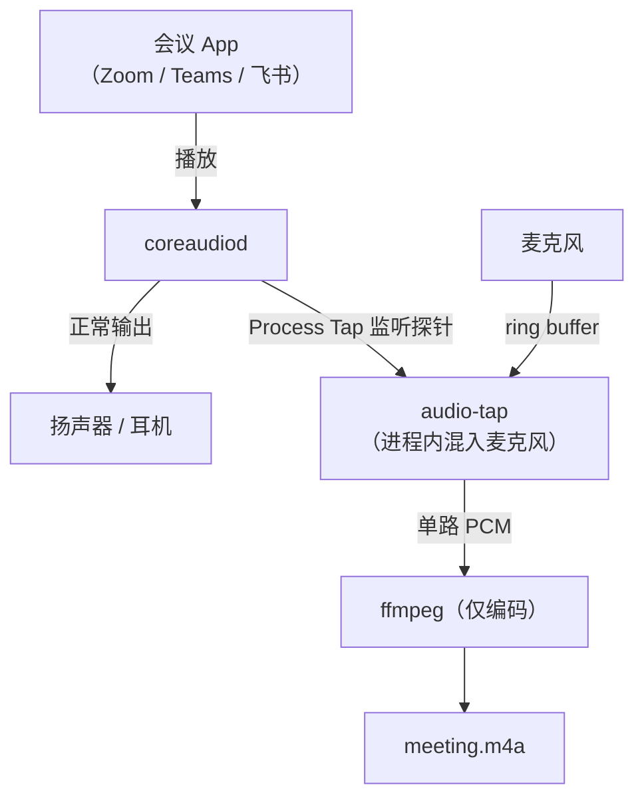
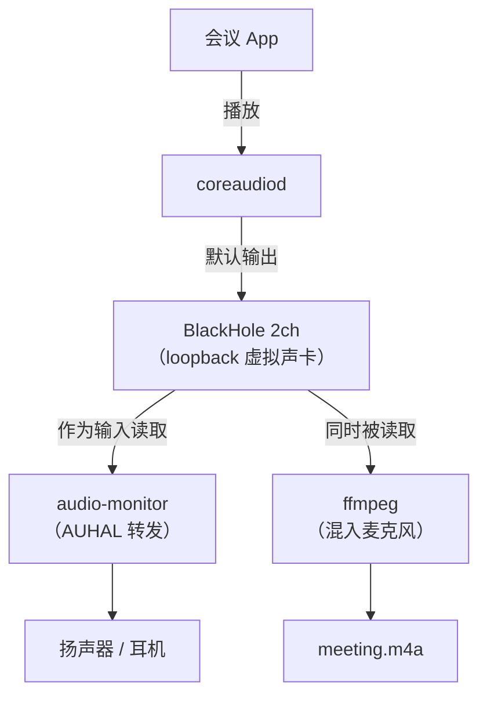
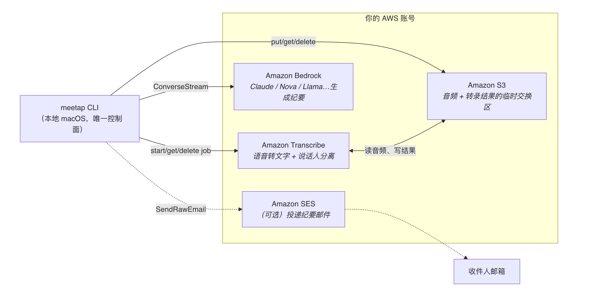
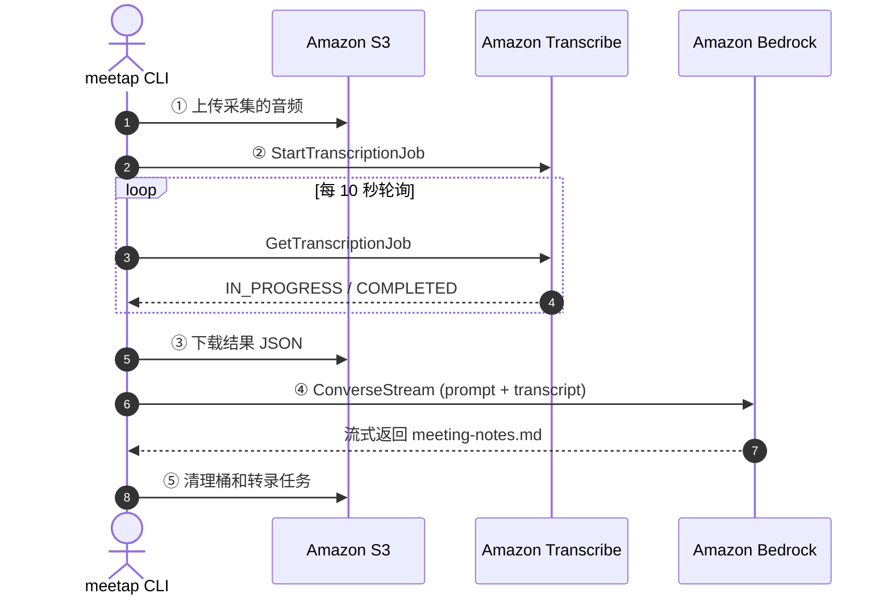

# MeeTap

> 🎙️ **MeeTap** · 一键启用，无感采集，智能纪要 —— 让 Mac 上的每一段音频自动变成结构化笔记。

**MeeTap** 是一款面向 **macOS** 的本地化智能音频转纪要工具，将"音频采集 → 转写 → 摘要"全流程自动化，让会议与学习内容一键沉淀为结构化笔记。

------


### 🔧 工作流程

1. **音频捕获** —— 优先使用 macOS **Process Tap**（14.4+）直接、无感地采集系统音频，**免装虚拟声卡、不切换输出设备**；旧系统自动回退 **BlackHole 虚拟声卡**。无缝兼容 Zoom、Teams、飞书、腾讯会议等主流会议应用；
2. **语音转写** —— 音频采集结束后自动上传至 **AWS Transcribe**，输出带**说话人分离（Speaker Diarization）**的结构化文本；
3. **智能摘要** —— 通过 **Amazon Bedrock** 调用大语言模型（默认 **Claude Sonnet**，一键切换 Nova、Llama、DeepSeek 等），生成条理清晰的**中文会议纪要**。

------


### 🎯 适用场景

除在线会议外，亦可用于 **YouTube 视频、播客、线上课程、访谈录音**等任意 Mac 播放的音视频内容归档，覆盖**会议记录、学习笔记、资料整理、访谈转写**等多样化需求。

------

### ✨ 核心特性

| 特性                 | 说明                                                         |
| :------------------- | :----------------------------------------------------------- |
| 🚀 **开箱即用**       | 首次启动自动生成默认配置，零学习成本，即装即用               |
| 🎧 **免装免切换**     | macOS 14.4+ 走 Process Tap 直接采集，无需安装 BlackHole、无需切换系统输出设备；录制时你照常从原扬声器/耳机听到原声 |
| 👻 **零侵入音频采集** | 无需以 "Bot 参会者" 身份加入会议，与会者全程无感知，规避合规风险 |
| ⏱️ **时长自停**       | `meetap start -d <分钟>` 指定会议时长上限，到点自动结束、自动转录 |
| 📊 **实时波形**       | 终端底部实时点阵波形，融合系统音 + 你的麦克风，一眼确认"确实在录、双向都有声" |
| ✍️ **智能纪要**       | Claude Sonnet 5 生成，自动按主题命名文件；可补资料、提要求 `again` 重写 |
| 📧 **专业邮件**       | 纪要自动渲染为 HTML 邮件（兼容 Outlook）+ PDF 附件，一键发给收件人 |
| 💰 **按量计费**       | 无订阅、无最低消费，一场会约几毛钱                          |
| 🔐 **数据主权**       | 所有音频与纪要仅在你**自己的 AWS 账号**内流转，不经第三方云服务；任务结束自动清理，隐私可控 |
| 🌐 **双语 CLI**       | 终端输出支持 `zh-CN` / `en-US` 切换（仅影响界面语言，**纪要内容始终为中文**） |

---


## 一、前置条件

1. **macOS 13+（Ventura 或更新）**
   - **macOS 14.4+** 可启用 Process Tap，免装 BlackHole；此处 14.4+ 指 Sonoma 14.4 及之后的所有版本，涵盖 macOS 15 Sequoia、macOS 26 Tahoe（截至 2026 年 7 月最新为 26.6）；
   - **macOS 13.x** 或 Tap 授权未生效时，自动回退 BlackHole（需装虚拟声卡，见安装步骤）。
2. **Xcode Command Line Tools**（首次安装会自动提示）
   
   ```bash
   xcode-select --install
   ```
3. **AWS 账号**，并已在 [Bedrock 控制台](https://console.aws.amazon.com/bedrock/) 的 **Model access** 开通以下任一模型（MeeTap 默认用 Claude Sonnet）：
   - Anthropic Claude Sonnet
   - Amazon Nova Pro
   - Meta Llama、Mistral、DeepSeek 等任意支持 Converse API 的模型

---


## 二、安装（任选一种）

### 方式 A：Homebrew Tap（推荐）

```bash
# 一次性 tap（只需做一次）
brew tap henceman777/tap

# 之后这样安装和升级
brew install meetap
brew upgrade meetap
# 自动安装依赖：ffmpeg, switchaudio-osx, blackhole-2ch
# blackhole-2ch 仅作旧系统回退用；macOS 14.4+ 走 Process Tap 时不会用到它
```

> 也可以一行搞定（自动 tap + install，但命令较长）：
> ```bash
> brew install henceman777/tap/meetap
> ```

### 方式 B：从源码构建

```bash
# 1. 装依赖（blackhole-2ch 仅旧系统回退需要，14.4+ 可不装）
brew install ffmpeg switchaudio-osx awscli
brew install blackhole-2ch   # 可选：仅 macOS 13.x / Tap 不可用时需要

# 2. clone & 编译安装
git clone https://github.com/henceman777/meetap.git
cd meetap
make install     # 编译 audio-tap / audio-monitor / audio-multi-output 并装到 ~/bin

# 3. 若使用 BlackHole 回退，让系统识别它（音频会断 2–3 秒）
sudo killall coreaudiod
```

> **关于音频权限**：Process Tap 首次采集会触发 macOS 的"系统音频录制"授权。`make install` 已为 `audio-tap` 嵌入权限描述并重新签名；首次运行 `meetap setup` 会检测并引导你完成授权。


### 从旧版本升级到 1.5.0（macOS 14.4+ 用户必看）

1.5.0 默认改用 **Process Tap** 采集，它需要一项旧版从未申请过的权限——**"系统音频录制"**（旧版走 BlackHole，不涉及此权限）。若不提前授权，升级后第一次录制可能录到全静音的系统声、开完会才发现。**升级后先跑一次 `meetap setup` 确认授权，再开始正式会议最稳妥。**

```bash
# 1. 升级到 1.5.0
brew upgrade meetap                 # Homebrew 安装
# 或源码安装：cd meetap && git pull && make install

# 2. 确认授权（关键一步，会做一次 2 秒实测）
meetap setup

# 3. 验证版本
meetap version                      # 应显示 MeeTap v1.5.0
```

`meetap setup` 会自动做一次 2 秒实测：

- **探测通过** → 记下"授权已确认"标记，之后 `meetap start` 直接开录、不再提示；
- **探测为静音** → `setup` 会自动打开 **系统设置 › 隐私与安全性 › 屏幕与系统录音**，把你的终端 App（Ghostty / Terminal / iTerm 等）加进"仅系统录音"，按提示复测；部分终端（如 Ghostty）不会自动弹授权框，必须手动添加。

> **注意**：`auto` 模式在 macOS 14.4+ 上会直接走 Process Tap，**授权未生效不会自动回退、会录到静音**。所以升级后务必先跑一次 `meetap setup` 完成授权；若尚未跑过，`meetap start` 会提示你先做授权自检（但不会阻断录制）。授权前如需应急录制，可在配置里把 `audio_capture` 改为 `blackhole` 走旧方式（需已安装 BlackHole）。

> **macOS 13.x 用户**：无 Process Tap，行为与旧版一致，继续走 BlackHole，升级后无需额外授权操作。

---


## 三、一次性配置

### 1. 配置 AWS CLI

```bash
aws configure
# 输入 Access Key / Secret / region（us-east-1 或其他开通了 Bedrock 的区域）
```

确保你的 AWS 账号具备以下权限（完整清单见附录）：`s3:PutObject/GetObject/DeleteObject`、`transcribe:*TranscriptionJob`、`bedrock:InvokeModelWithResponseStream`、（可选 SES 发邮件）`ses:SendRawEmail`。

### 2. 音频录制授权（仅首次）

```bash
meetap setup
```

- **检测并引导 Process Tap 授权**（macOS 14.4+）——`setup` 会做一次 2 秒实测；若为静音，会自动打开 系统设置 › 隐私与安全性 › 屏幕与系统录音，引导你把终端 App 加进"仅系统录音"，按提示复测。这是 Tap 模式下唯一需要的一次性准备。
- **会议 App 扬声器配置：Tap 模式自动跳过**——`setup` 会根据实际采集路径决定：Tap 授权通过时，直接跳过 Zoom / Teams / 腾讯会议的扬声器配置（Process Tap 采集整个系统混音，与会议 App 的扬声器设置无关）；仅当走 BlackHole 回退（macOS 13.x，或配置为 `blackhole`）时，才会逐个引导把各会议 App 的扬声器指向 BlackHole。

授权完成后，除非更换终端 App 或系统升级导致权限变动，否则不需再跑。

### 3. （可选）修改默认配置

首次运行 `meetap` 任何命令时，会自动在 `~/.config/meetap/config` 生成一份默认配置。要改的话：

```bash
meetap config           # 在 $EDITOR 里打开配置文件
meetap config show      # 查看当前所有配置项
```

关键配置项说明：

| 字段 | 默认 | 说明 |
|---|---|---|
| `region` | `us-east-1` | AWS 区域（影响 S3 / Transcribe / Bedrock） |
| `model` | `global.anthropic.claude-sonnet-5` | 纪要生成使用的 Bedrock 模型 ID |
| `audio_capture` | `auto` | 采集方式：`auto`（14.4+ 用 Tap，否则 BlackHole）/ `tap` / `blackhole` |
| `transcribe_languages` | `en-US zh-CN ja-JP` | Transcribe 候选语言（按优先级） |
| `multi_language` | `false` | 同一会议中英混讲时改 `true` |
| `language` | `zh-CN` | CLI 界面语言（en-US 或 zh-CN）—— **不影响纪要** |
| `email` | 空 | 纪要收件人，留空则跳过邮件 |
| `email_sender` | 空 | SES 已验证的发件人，设了 email 必填 |

重置为默认：`rm ~/.config/meetap/config` 后再跑任意 `meetap` 命令。

---


## 四、日常使用

整个工作流只有两行命令：

```bash
meetap start   # 开会前或开会过程中随时可以敲
meetap stop    # 会议结束后敲；自动转录 + 生成纪要
```

### 开始音频采集

```bash
$ meetap start

🎙️  录制已开始
   播放: MacBook Pro Speakers (Process Tap)
   停止录制: /Users/you/bin/meetap stop
   自动停止: 关闭（手动 stop 结束）
```

想让会议到点自动结束，加 `-d` 指定分钟数：

```bash
$ meetap start -d 60

🎙️  录制已开始
   播放: MacBook Pro Speakers (Process Tap)
   停止录制: /Users/you/bin/meetap stop
   自动停止: 60 分钟后（约 15:30）
```

音频采集期间：

- **你正常开会**，音频照常从原来的扬声器 / 耳机里播放（Process Tap 不切换输出设备；BlackHole 回退时由 audio-monitor 实时转发）
- **终端底部**会显示麦克风电平 + 时长
- 指定了 `-d` 时，到达时长上限会自动停止；否则一直录到你手动 `stop`
- **走 BlackHole 回退时，不要手动切换系统音频输出**，否则音频采集会无声（Process Tap 模式无此限制）

### 停止 + 自动生成纪要

```bash
$ meetap stop

⏳ 等待录制完成...
🔊 音频输出已恢复: MacBook Pro Speakers
✅ 音频采样成功
📝 后台转录已启动（完成后会收到通知）
```

`stop` 命令会立刻返回，转录和纪要生成在后台跑（30s~几分钟，看会议长度）。完成后 macOS 右上角会弹通知。

### 断点续跑 / 重新生成纪要

`meetap again` 主要用于**从失败处续跑**：上传、转录或纪要生成任一步中断或失败时，直接续跑到完成，**音频无需重录**。它会自动判断从哪一步接续：

- 已转录成功、仅纪要未生成 → 只重跑纪要生成这一步；
- 转录也未成功 → 从上传 + 转录开始把整条链路重跑一遍；
- 旧纪要自动归档到 `archive/`（加时间戳），不会覆盖丢失。

```bash
meetap again                              # 续跑 / 重新生成最近一次会议
meetap again 20260731_1430_季度评审        # 指定某次会议
meetap again '' '请用要点列表重写，突出决策项与负责人'   # 附带补充要求，直接传给 LLM
```

顺带也能用它**改善纪要质量**：把参考资料（议程 / PPT 导出 / 背景文档，支持 md/txt/pdf/docx/html）放进该会议目录的 `materials/` 子目录，`meetap again` 会自动读取喂给模型，辅助修正人名、术语；或用第二个参数附带补充要求直接传给 LLM。

### 查看结果

产物默认在 `~/Record/<YYYYMMDD_HHMM>/`：

```
~/Record/20260731_1430/
├── meeting-notes.md       ← 结构化纪要（主要看这个）
├── meeting-notes.html     ← 排版后的 HTML 版
├── meeting-notes.pdf      ← 用于邮件附件的 PDF（若配了邮件）
├── materials/             ← （可选）放参考资料，重新生成时注入
└── log/
    ├── transcript.txt     ← 带说话人标签的转录
    ├── speaker-stats.txt  ← 每人发言时长占比
    ├── transcribe-raw.json ← Transcribe 原始 JSON
    └── meetap.log         ← 每一步时间戳（调试用）
```

### 其他常用命令

```bash
meetap status       # 查看当前是否在音频采集
meetap config       # 编辑配置
meetap config show  # 查看当前配置值
meetap version      # 显示版本号
meetap help         # 显示所有命令
```

---

## 五、（可选）自动发送邮件

想让纪要自动发给固定几个人？在配置里填上收件人和 SES 发件人：

```ini
email = alice@example.com, bob@example.com
email_sender = meetap@yourdomain.com
```

前提是 `email_sender` 已经在 [SES 控制台](https://console.aws.amazon.com/ses/) 完成发件人验证（AWS 反滥用要求，无法绕过）。下次会议结束，MeeTap 会自动把 Markdown 渲染成 PDF，通过 SES 发送。

不需要邮件？空着这两项就行，整条链路会自动跳过。

---

## 六、实现原理

### 6.1 音频采集：Process Tap 首选，BlackHole 兜底

macOS 不允许 App 抓取其他 App 的音频输出，MeeTap 提供两条采集路径，`auto` 模式按系统能力自动选择：

**首选：Process Tap（macOS 14.4+）**

系统原生的 [Core Audio Process Tap](https://developer.apple.com/documentation/coreaudio)（macOS 14.4 引入的 `AudioHardwareCreateProcessTap` + `CATapDescription`）直接在 coreaudiod 的系统混音总线上"接一根监听探针"——在音频送往扬声器 / 耳机的**同一条链路上旁路复制一份**交给采集进程，采集全部系统音频，音频照常从原设备正常播放，用户听感零变化。麦克风在同一进程内混入（借鉴 meetily 的 ring-buffer 混音架构），ffmpeg 只做编码、零设备访问，彻底消除设备抢占与枚举竞态。

相较旧的 BlackHole 虚拟声卡方案，它的优点是：

- **零安装、零配置**：系统原生能力，无需安装虚拟声卡、无需 `sudo killall coreaudiod`、无需在会议 App 里手动改扬声器；
- **不改变默认输出设备**：用户仍从原扬声器 / 耳机听原声，不存在"录制期间误切输出就没声"的坑；
- **进程内混麦、零设备竞争**：麦克风在 audio-tap 进程内混入，ffmpeg 只负责编码、不碰任何音频设备，从根上消除设备抢占与枚举竞态；
- **拿到真实采样率**：直接读 tap 的实际格式（`kAudioTapPropertyFormat`），不依赖设备标称率，避免时长错拉与音调失真。


```mermaid
%%{init: {'flowchart': {'curve': 'basis'}}}%%
flowchart TB
    APP["会议 App<br/>（Zoom / Teams / 飞书）"] -->|播放| CAD[coreaudiod]
    CAD -->|正常输出| SPK[扬声器 / 耳机]
    CAD -->|Process Tap 监听探针| TAP["audio-tap<br/>（进程内混入麦克风）"]
    MIC[麦克风] -->|ring buffer| TAP
    TAP -->|单路 PCM| FF["ffmpeg（仅编码）"]
    FF --> M4A[meeting.m4a]
```

**兜底：BlackHole（macOS 13.x / Tap 不可用）**

把 BlackHole 软件声卡设成系统默认输出——它同时是输出和输入，被两个消费者并行订阅：一路由 audio-monitor 还原给用户听（端到端延迟 < 10 ms），一路交给 ffmpeg 采集。会议 App 毫无感知。此模式下录制期间不要手动切换系统输出。


```mermaid
%%{init: {'flowchart': {'curve': 'basis'}}}%%
flowchart TB
    APP["会议 App"] -->|播放| CAD[coreaudiod]
    CAD -->|默认输出| BH["BlackHole 2ch<br/>（loopback 虚拟声卡）"]
    BH -->|作为输入读取| MON["audio-monitor<br/>（AUHAL 转发）"]
    BH -->|同时被读取| FF["ffmpeg<br/>（混入麦克风）"]
    MON --> SPK[扬声器 / 耳机]
    FF --> M4A[meeting.m4a]
```

### 6.2 云端处理：客户端直连 4 个托管服务

音频采集到本地后，meetap CLI 作为唯一控制面，在一次 `meetap stop` 的命令生命周期内：上传、转录、生成纪要、（可选）发邮件、清理——**没有 Lambda、没有常驻基础设施，账户里不留临时资源**。


**架构组成**（谁在哪、谁管什么）：



没有 VPC、没有集群、没有"我家的服务器"——4 个托管服务通过 SDK/CLI 直接调用。

**调用顺序**（一次完整流程）：


```mermaid
sequenceDiagram
    autonumber
    actor U as meetap CLI
    participant S3 as Amazon S3
    participant TX as Amazon Transcribe
    participant BR as Amazon Bedrock

    U->>S3: ① 上传采集的音频
    U->>TX: ② StartTranscriptionJob
    loop 每 10 秒轮询
        U->>TX: GetTranscriptionJob
        TX-->>U: IN_PROGRESS / COMPLETED
    end
    U->>S3: ③ 下载结果 JSON
    U->>BR: ④ ConverseStream (prompt + transcript)
    BR-->>U: 流式返回 meeting-notes.md
    U->>S3: ⑤ 清理桶和转录任务
```

流式返回让纪要在眼前"慢慢长出来"，而不是等 30 秒才一次性出现。

---


## 七、故障排查

| 症状 | 原因 / 解决 |
|---|---|
| 首次 `start` 提示无系统音频权限 / 录音全静音 | 运行 `meetap setup` 完成 Process Tap 授权；或在系统设置 → 隐私与安全性 → 系统音频录制 中允许 |
| `start` 后听不到会议声音（BlackHole 模式） | 先运行 `meetap stop`，再 `sudo killall coreaudiod`，等几秒后重试 |
| 转录失败：`AWS credentials not configured` | 跑 `aws configure` 或检查 `AWS_PROFILE` |
| 转录失败：`AccessDenied` / `ValidationException` | 确认账号已开通 Bedrock Model access，且 IAM 有 `bedrock:InvokeModelWithResponseStream` 权限 |
| 纪要生成卡在 "Generating meeting notes..." | 检查 `~/Record/.../log/meetap.log` 查看具体 AWS 报错 |
| 音频采集有回声 | 戴耳机采集；外放会把扬声器声音二次采入 |
| 系统通知没弹出 | 系统设置 → 通知 → 允许 "终端" 或 "Script Editor" 发送通知 |

---


## 附录 A：最小 IAM 权限

给 MeeTap 使用的 IAM 用户或角色附加以下策略（按需启用 SES 部分）：

```json
{
  "Version": "2012-10-17",
  "Statement": [
    {
      "Sid": "S3ObjectOps",
      "Effect": "Allow",
      "Action": [
        "s3:PutObject",
        "s3:GetObject",
        "s3:DeleteObject",
        "s3:PutBucketPublicAccessBlock"
      ],
      "Resource": [
        "arn:aws:s3:::meetap-transcribe-*",
        "arn:aws:s3:::meetap-transcribe-*/*"
      ]
    },
    {
      "Sid": "TranscribeStartJob",
      "Effect": "Allow",
      "Action": ["transcribe:StartTranscriptionJob"],
      "Resource": "*",
      "Condition": {
        "StringEquals": { "aws:RequestedRegion": "us-east-1" }
      }
    },
    {
      "Sid": "TranscribeGetDeleteJob",
      "Effect": "Allow",
      "Action": [
        "transcribe:GetTranscriptionJob",
        "transcribe:DeleteTranscriptionJob"
      ],
      "Resource": "arn:aws:transcribe:us-east-1:*:transcription-job/meetap-*"
    },
    {
      "Sid": "BedrockInvoke",
      "Effect": "Allow",
      "Action": ["bedrock:InvokeModelWithResponseStream"],
      "Resource": [
        "arn:aws:bedrock:us-east-1::foundation-model/anthropic.claude-sonnet-4-*",
        "arn:aws:bedrock:us-east-1:*:inference-profile/us.anthropic.claude-sonnet-4-*"
      ]
    },
    {
      "Sid": "SESSendFromConfiguredSender",
      "Effect": "Allow",
      "Action": ["ses:SendRawEmail"],
      "Resource": "arn:aws:ses:us-east-1:*:identity/noreply@example.com",
      "Condition": {
        "StringEquals": {
          "ses:FromAddress": "noreply@example.com"
        }
      }
    }
  ]
}
```

> **最小权限说明**（依据 AWS Service Authorization Reference 逐动作核实后收紧）：
> - **S3**：移除了无效的 `s3:CreateBucket`（该动作不支持按桶名限定资源，写在此处无效）和代码未调用的 `s3:ListBucket`；补充了代码实际调用的 `s3:PutBucketPublicAccessBlock`。请在首次运行前**手动预建桶**，桶名格式为 `meetap-transcribe-<AccountID 短哈希>-<region>`（哈希由 `echo -n <AccountID> | shasum -a 256 | cut -c1-12` 计算），或临时附加带 `s3:CreateBucket` 的宽松策略跑一次后收回。
> - **Transcribe**：`StartTranscriptionJob` 是创建型动作，**官方不支持资源级 ARN**（Resource types 列为空），只能用 `Resource: "*"` + `aws:RequestedRegion` 条件锁定 region——强行给它加 ARN 会导致启动转录被拒。`GetTranscriptionJob` / `DeleteTranscriptionJob` 支持资源级 ARN，已收窄到 `transcription-job/meetap-*`（匹配代码里的 `meetap-<时间戳>-<PID>` 任务名）。切换 region 时两处都要同步修改。
> - **Bedrock**：`foundation-model` 与 `inference-profile` ARN 均已锁定 `us-east-1`。若切 region 或改用其他模型（Nova / Llama / DeepSeek 等），请同步调整 ARN。
> - **SES**：`Resource` 已收窄到发件人 identity ARN，并保留 `ses:FromAddress` 条件双重限制。使用前请注意三点：
>   1. **identity 必须已在 SES 验证**，且 ARN 里的 **region 要与你验证 identity 的 region 一致**（未必是 `us-east-1`——SES identity 是按 region 独立验证的）；ARN region 与 `email_sender` 实际发信 region 不匹配会导致 IAM 拒绝、邮件发不出。
>   2. 将两处 `noreply@example.com` 替换为你验证的实际发件地址。**若验证的是邮箱**，`identity/` 后写完整邮箱；**若验证的是整个域**，改用域 identity ARN（`identity/example.com`）并保留 `ses:FromAddress` 条件锁定具体发件人——域验证方式对未单独验证的邮箱也生效，更通用。
>   3. **新账户 SES 默认处于 sandbox**，只能发给已验证的收件地址；要给任意与会者发送需先在 SES 控制台申请生产访问（Production Access）。

**建议**：同时在 [AWS Budgets](https://console.aws.amazon.com/cost-management/home#/budgets) 设一个 $10/月 的告警，防止异常用量。


## 附录 B：成本参考（us-east-1）

| 服务 | 单价 | 30min 会议典型开销 |
|---|---|---|
| Transcribe (standard, async) | $0.024/min | ≈ $0.72 |
| Bedrock Claude Sonnet | 按输入 / 输出 token 计价 | ≈ $0.01–0.05 |
| S3 | 秒级存在 + 即删 | ≈ $0 |
| SES | 前 62,000 封/月免费 | ≈ $0 |
| **合计** | | **≈ $0.73–0.77** |

换用 Nova / DeepSeek 等模型可进一步降低纪要生成成本，具体以 [Bedrock 当前定价](https://aws.amazon.com/bedrock/pricing/) 为准。

---


## 开发

```bash
git clone https://github.com/henceman777/meetap.git
cd meetap
make            # 只编译，不安装
make install    # 安装到 ~/bin（含 audio-tap 重新签名，保证 Process Tap 授权生效）
make clean      # 清理构建产物
```

代码布局：

```
src/
├── meetap                    # bash 主控脚本
├── audio-tap.swift           # Core Audio Process Tap 采集 + 麦克风进程内混音（macOS 14.4+）
├── audio-tap-Info.plist      # 嵌入 audio-tap 的音频录制权限描述
├── audio-multi-output.swift  # CoreAudio 设备管理（SwitchAudioSource 薄封装，BlackHole 回退用）
├── audio-monitor.swift       # AUHAL AudioUnit 实时音频转发（BlackHole 回退用）
└── i18n/                     # CLI 双语消息表
```


## License

MIT
